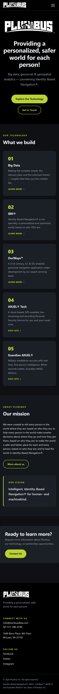
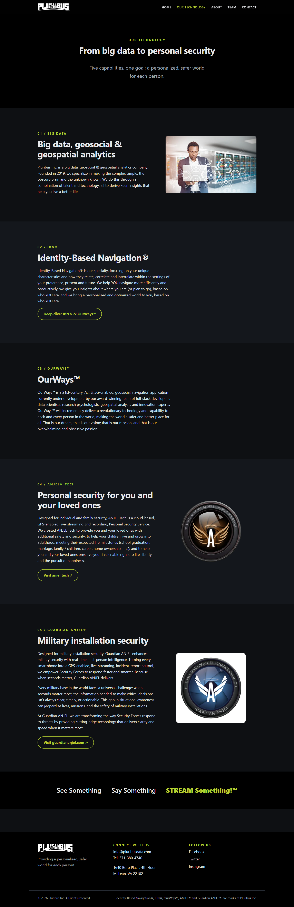
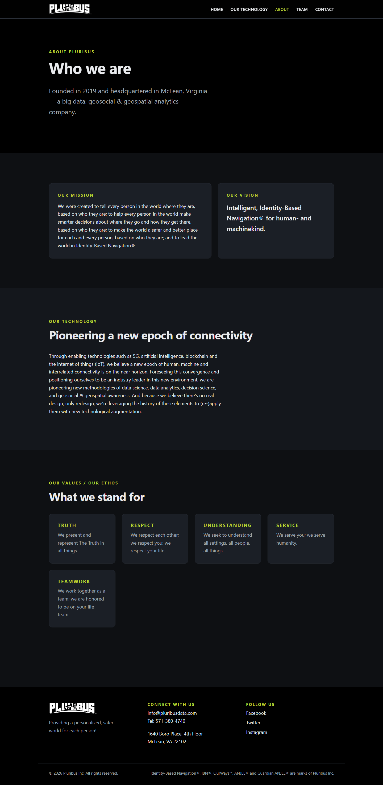
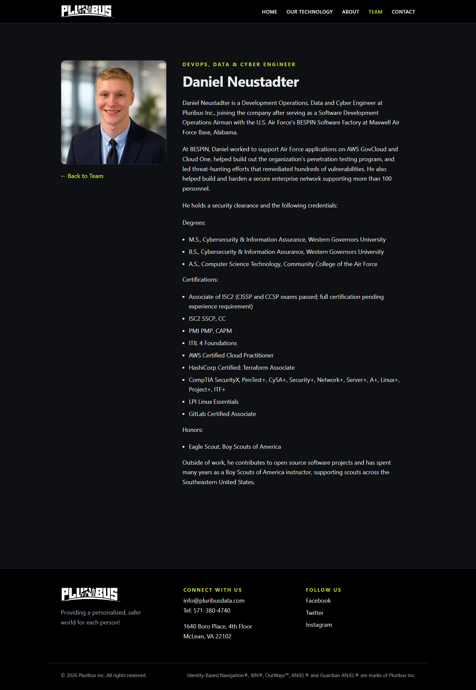
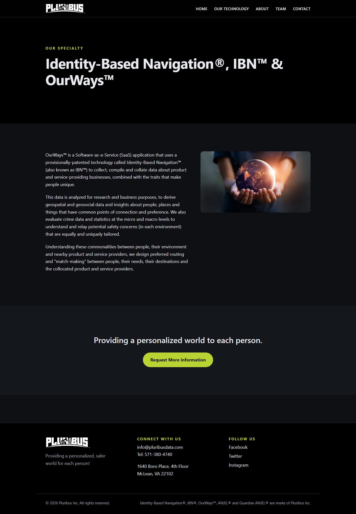
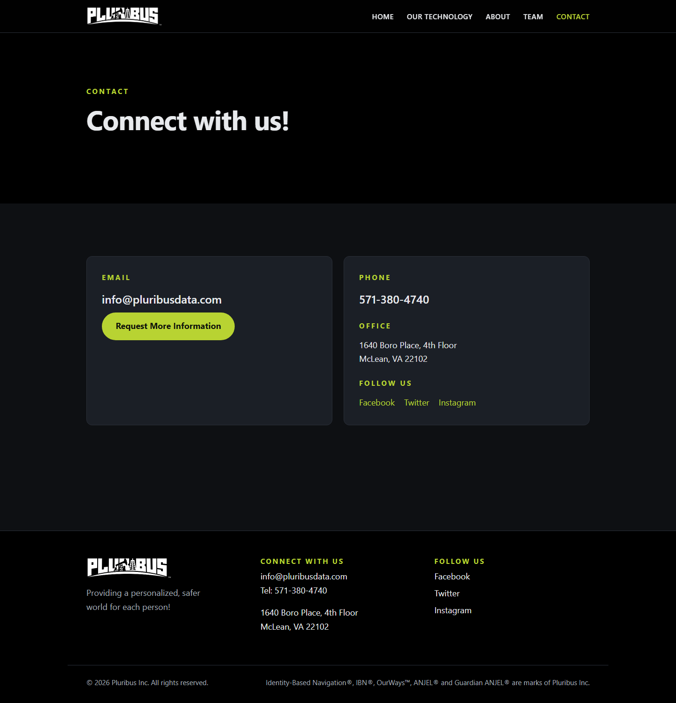

# Pluribus Inc. — Company Website

Public marketing website for [Pluribus Inc.](https://pluribusdata.com), built with
[Astro](https://astro.build) as a fully static site. No backend required.

> **Content policy:** this site contains only public marketing content. Do not add
> anything from private/internal repositories.

## Commands

| Command           | Action                                        |
| :---------------- | :-------------------------------------------- |
| `npm install`     | Install dependencies                          |
| `npm run dev`     | Start dev server at `http://localhost:4321`   |
| `npm run build`   | Build the production site to `./dist/`        |
| `npm run preview` | Preview the built site locally                |

## Project structure

```text
src/
  layouts/Base.astro         Shared <head>, header/nav, footer
  components/                SectionHeading, TechCard, TeamCard
  pages/                     index, technology, about, contact, 404,
                             identity-based-navigation, team/
  pages/team/[slug].astro    Bio pages generated from src/content/team/
  content/team/*.md          One markdown file per team member (name, title,
                             headshot, order in frontmatter; bio in the body)
  assets/images/             Source images (optimized by Astro at build time)
  styles/global.css          Design system: tokens, type scale, buttons,
                             paper/ink sections, reveal animation
  scripts/site.ts            Site-wide behaviors (reveal, word split, tilt,
                             spotlight, parallax, scroll-spy, progress bar)
  scripts/geomap.ts          Interactive canvas "geosocial map" in the hero
public/                      Favicon and the Pluribus logo (served as-is)
```

To add or edit a team member, add/edit a markdown file in `src/content/team/` and
drop the headshot in `src/assets/images/team/`.

## Design notes

- **Copy is verbatim** from pluribusdata.com. The redesign changes layout,
  typography and motion only; do not paraphrase descriptive text.
- **No runtime third-party dependencies.** Fonts (Archivo, Inter, IBM Plex
  Mono) are self-hosted through `@fontsource` packages and bundled at build
  time, so the published site makes no requests to Google Fonts or any CDN.
  Animations are plain CSS plus two small vanilla-TS modules in
  `src/scripts/`; there is no JS framework or UI-component library.
- Pages use Astro view transitions (`<ClientRouter />`), so behaviors are
  (re)initialised on `astro:page-load` and torn down on `astro:before-swap`.
- Interactive pieces are opt-in via data attributes: `data-tilt`,
  `data-spotlight`, `data-split`, `data-words`, `data-parallax`,
  `data-geomap`. See the header comment in `src/scripts/site.ts`.
- Motion respects `prefers-reduced-motion` (the hero map renders one static
  frame); reveal animations are gated on a `js` class so content is never
  hidden without JavaScript.

## Deploying

`npm run build` produces a plain static site in `dist/` — every page is a
`directory/index.html`, so it works on any static host.

### AWS S3 + CloudFront

```sh
npm run build
aws s3 sync dist/ s3://YOUR_BUCKET_NAME --delete
aws cloudfront create-invalidation --distribution-id YOUR_DISTRIBUTION_ID --paths "/*"
```

Recommended CloudFront settings:

- Origin: the S3 bucket (use Origin Access Control; keep the bucket private)
- Default root object: `index.html`
- To serve `/about/` style URLs from S3 correctly, either enable S3 static
  website hosting as the origin, or add a CloudFront Function that rewrites
  `*/` requests to `*/index.html`
- Custom error response: map 403/404 to `/404.html`

### GitHub Pages

This repo deploys automatically: every push to `main` runs
[.github/workflows/deploy.yml](.github/workflows/deploy.yml), which builds the
site and publishes it to GitHub Pages at https://pluribusdatateam.github.io.
Requirements (one-time repo setup):

1. Repo must be public (or the org on a paid plan) for Pages to publish
2. Settings → Pages → Build and deployment → Source: **GitHub Actions**

The site is served from the domain root, so no `base` path is needed. If it
ever moves to a subpath (`…github.io/repo-name/`), set `base: '/repo-name'` in
[astro.config.mjs](astro.config.mjs).

## Contact form

There is no form backend yet — the contact page uses a `mailto:` link. To add a
hosted form later, see the comment in
[src/pages/contact.astro](src/pages/contact.astro).

## v1 snapshot

Captured 2026-07-29 from this branch: the v1 design with all descriptive copy
restored verbatim from pluribusdata.com (team bios word-for-word as their
subjects wrote them). The `v1` tag preserves the original point-in-time
snapshot. Full-page desktop captures at 1440px; mobile at 390px.

### Home




### Our Technology



### About



### Team


Individual bio page (representative):



### Identity-Based Navigation



### Contact


